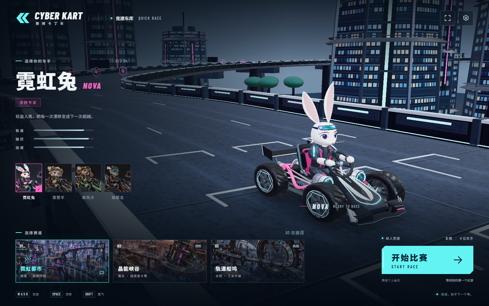
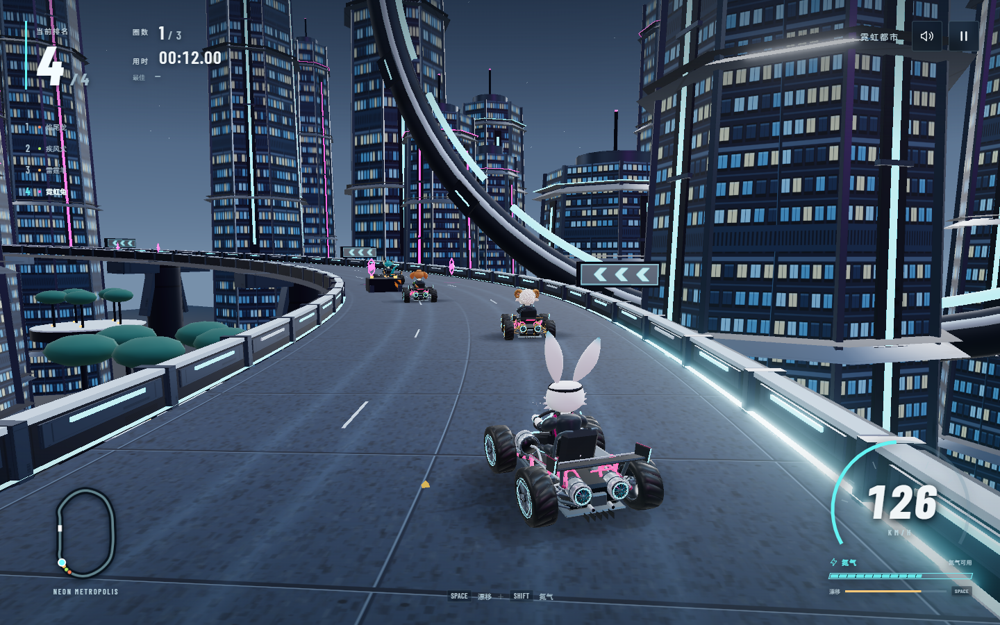
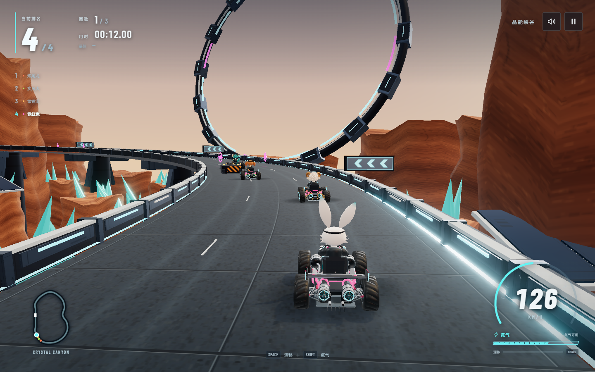
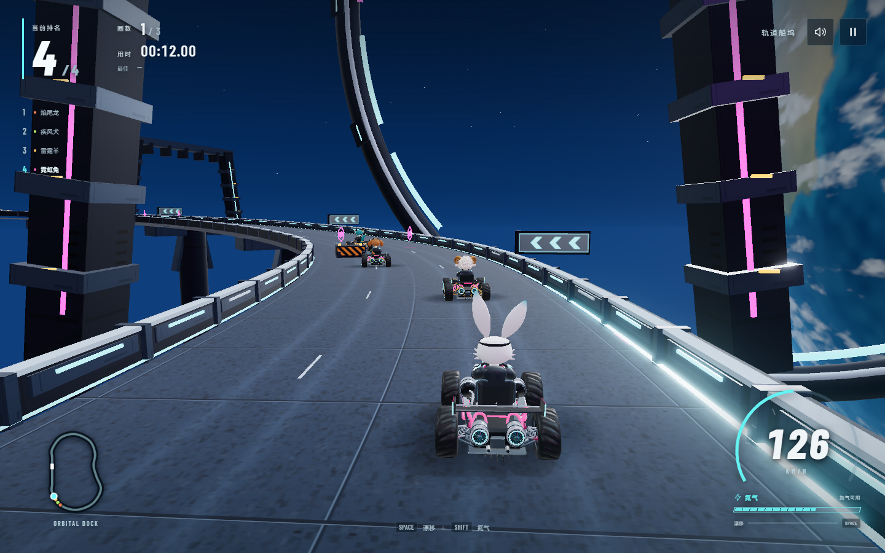
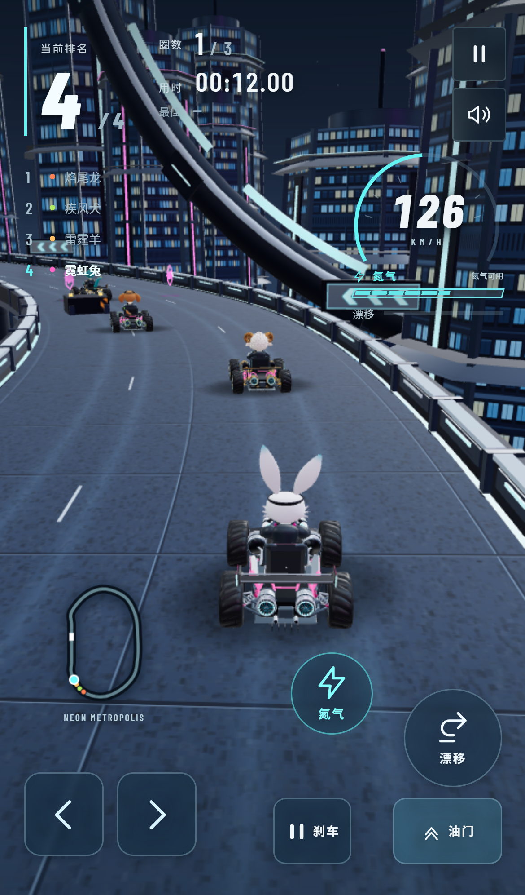

# 赛博卡丁车 · CYBER KART

一款在浏览器中驾驶的动物赛博卡丁车游戏。选一位车手，在三条立体赛道上与 **3 名 AI 对手跑完 3 圈**：入弯漂移积攒能量，出弯松开获得小喷，再用氮气抢占直道。游戏支持键盘和触控，提供小地图、圈数与名次 HUD、暂停/重开和本地最佳纪录。

项目使用 Three.js、TypeScript、Vite 与 Blender 制作，仓库包含完整代码、运行时资源与可重建模型源。它是单机街机竞速体验，不需要游戏服务器或账号。

**[在线试玩 →](https://dorarabbityan.github.io/tuzai-cyber-kart/)** · 电脑用键盘驾驶，手机使用屏幕触控按钮。



## 三条路线，四位车手

以下均为游戏实际运行截图。

| 霓虹都市 | 晶能峡谷 | 轨道船坞 |
| --- | --- | --- |
|  |  |  |
| 城市高架与霓虹灯带，熟悉入弯、漂移和氮气节奏。 | 赤岩、青色晶簇与连续发卡弯，考验转向和弯心选择。 | 太空工业环道，在轨道设施之间穿行，挑战连续路线判断。 |

| 车手 | 特点 |
| --- | --- |
| 霓虹兔 NOVA | 白兔与品红配色，转向灵活，适合练习漂移。 |
| 雷霆羊 BOLT | 卷角小羊与金色车身，加速较快。 |
| 疾风犬 SCOUT | 垂耳小狗与青柠配色，四位车手中转向最灵敏。 |
| 焰尾龙 EMBER | 青色小龙、橙色灯带与长尾，极速更高，转向需要提前规划。 |

## 克隆并运行

需要 Node.js 22.12+。仓库已包含完整运行时模型、音频、图片和字体，运行游戏不需要安装 Blender。

```bash
git clone https://github.com/DoraRabbitYan/tuzai-cyber-kart.git
cd tuzai-cyber-kart
npm ci
npm run dev
```

浏览器打开终端显示的本地地址。手机与电脑在同一局域网时，使用终端列出的 Network 地址；电脑防火墙需允许对应端口入站访问。

```bash
npm run build
npm run preview
```

`dist/` 可以部署到静态网站根目录或带结尾斜线的子目录，不需要游戏后端。首次加载后，游戏逻辑和音频在浏览器本地运行；未实现离线缓存安装。

### 网站发布

网站由 GitHub Pages 托管。向默认分支 `codex/initial-release` 推送后，[部署工作流](.github/workflows/deploy.yml)会自动安装依赖、检查 TypeScript、构建并发布 `dist/`；也可在仓库 Actions 中手动运行 **Deploy Cyber Kart to GitHub Pages**。仓库 Settings → Pages 的发布源为 **GitHub Actions**。

模型、音频和字体与网站一同发布，资源路径使用相对 `base: './'`，适配 `/tuzai-cyber-kart/` 子目录。`.blend` 源文件、建模参考和本地测试记录不会进入网站构建包。

## 驾驶

| 动作 | 键盘 | 触控 |
| --- | --- | --- |
| 油门 | W / ↑ | 油门按钮；设置可启用自动油门 |
| 刹车 | S / ↓ | 刹车按钮 |
| 转向 | A、D / ←、→ | 左右方向按钮 |
| 漂移 | 按住空格并转向 | 按住漂移并转向 |
| 氮气 | Shift / N，消耗 40 能量 | 氮气按钮 |
| 暂停/继续 | Esc | 右上角暂停 |
| 静音 | M | 声音按钮 |

漂移会充能，持续漂移后松开可获得短时小喷。品红六边形补充 20 能量，橙色磁能带直接加速。护栏与车辆碰撞会减速。三圈后展示名次、完赛时间及本浏览器保存的赛道最佳纪录。



触控布局截图：桌面 GPU 上的移动视口与触控仿真，并非物理手机实测。

## 工程与资源

- `src/main.ts`：固定 60 Hz 循环、比赛状态、AI 集成、资源、相机和音画反馈。
- `src/simulation.ts`、`src/world.ts`：车辆运动、道路边界碰撞、三条路线和实例化环境。
- `src/ui.ts`、`src/style.css`、`src/audio.ts`：菜单/HUD/触控与音频混音、手势解锁和生命周期。
- `tests/`：物理与浏览器回归测试；`scripts/`：模型、音频、截图和质量检查工具。
- `public/models/`：四车完整 GLB、远景 GLB 和透明预览；角色 ID 为 `rabbit`、`sheep`、`dog`、`dragon`。
- `public/images/`、`public/audio/`、`public/fonts/`：运行时图片、原创合成 WAV 和本地字体。字体许可见 `public/fonts/OFL.txt`。
- `assets/blender/source-reference.blend`：车辆母版；四份 `{角色}.blend` 是当前可编辑游戏模型与渲染场景。
- `assets/blender/v1/`：早期底座，兔/羊面部重建读取这里的 `.blend`。
- `assets/blender/frozen/`：龙的冻结场景、法线图及狗/龙可选回归基准，均为重建输入，随仓库跟踪。
- `assets/references/`：10 张原始视觉参考和 4 张角色转面参考，供建模审阅；游戏运行时不加载这些大图。
- `artifacts/`：本地生成记录、审阅图和测试报告，默认不纳入 Git；干净克隆只包含用于保留目录的 `.gitkeep`。

GLB 为 +Z 朝前、Y 朝上，轮胎接地 y=0；四个 `wheel_fl/fr/rl/rr` 父节点围绕局部 X 轴滚动。近景保留面部细节与嵌入法线图。远景约 3.7 万三角面，完整保留车身、衣服和轮胎，仅简化面部细节。

诊断接口仅在开发模式或 `?qa=1` 下开放。自动画质在触控/窄屏设备关闭后处理和实时阴影，限制像素比例，保留车辆接触投影，并对远处 AI 使用 LOD。

## Blender 资源重建

日常运行无需 Blender。只在修改模型时展开以下步骤；[可编辑资产说明](assets/blender/README.md)介绍源文件结构。

<details>
<summary>展开模型与音频重建步骤</summary>

使用 Blender 5.2，在项目根目录执行。以下 PowerShell 示例中的安装位置可按本机修改。完整流程会覆盖对应 `.blend`、GLB 和生成记录；手工修改的场景应另存为独立源文件。

```powershell
$blenderExe = 'C:/Program Files/Blender Foundation/Blender 5.2/blender.exe'

# 1. 可选：重新生成早期车辆底座；仓库已包含 v1 底座。
& $blenderExe --background --python-exit-code 1 --python './scripts/blender_build_assets.py' -- rabbit sheep dog dragon

# 2. 读取 v1 底座，重建兔/羊面部。
& $blenderExe --background --python-exit-code 1 --python './scripts/blender_refine_faces.py' -- rabbit sheep

# 3. 读取车辆母版，重建狗/龙面部。
& $blenderExe --background --python-exit-code 1 --python './scripts/blender_refine_dog_dragon.py' -- dog dragon

# 3b. 从跟踪的冻结场景与法线复现交付龙模型。
& $blenderExe --background --python-exit-code 1 --python './scripts/blender_patch_dogdragon_surface.py'

# 4. 生成完整模型校验及 LOD 所需来源记录。
& $blenderExe --background --python-exit-code 1 --python './scripts/blender_validate_assets.py'

# 5. 最后从四份完整场景生成 LOD。
& $blenderExe --background --python-exit-code 1 --python './scripts/blender_build_lods.py'

# 6. 独立重导入完整/远景模型并检查来源哈希。
& $blenderExe --background --python-exit-code 1 --python './scripts/blender_validate_assets.py' -- --include-lods
```

第 3b 步读取 `assets/blender/frozen/dragon-round5.blend` 和 `dragon-normal.png`，不依赖本地历史 `artifacts`。它用于复现冻结交付版本；继续修改龙的几何时应使用新的源文件，避免被该步骤替换。相关 metrics 是可缺省的本地输出。

日常面部调整可只运行对应角色的步骤，例如 `-- rabbit` 或 `-- dragon`，再执行第 4–6 步。只运行 `blender_build_assets.py` 得到的是 v1 底座，不能复现当前四张面部。兔/羊脚本支持 `--render-only`，从现有 `.blend` 生成审阅图。

近景校验上限为 110k 三角形、40 draw、4 MB；远景上限为 45k、24 draw、1.6 MB。LOD 脚本会验证车身/轮胎/衣服的受保护拓扑不变，并校验源文件哈希。结构检查不能替代实际渲染审阅。

可选的狗/龙历史基准检查使用仓库中的 `frozen/{dog,dragon}-round5.glb`，不要求存在旧轮次报告：

```powershell
python './scripts/dogdragon_verify_revision.py'
```

音频使用 Python 标准库独立生成：

```powershell
python './scripts/generate_audio.py'
```

导出完成后重新执行 `npm run build`，让生产文件包含当前模型和 LOD。

</details>

## 测试与本地证据

仓库包含物理与浏览器回归测试。截图、模型校验、音频校验和性能报告在本地生成，不将开发者的历史日志或浏览器会话作为项目内容发布。

<details>
<summary>展开测试与证据采集命令</summary>

先构建，并在一个终端保持生产预览运行：

```powershell
npm run build
npm run preview -- --port 5189 --strictPort
```

另一个终端运行测试和证据采集：

```powershell
$env:TEST_URL = 'http://127.0.0.1:5189/?qa=1'
npx playwright install chromium
npm test
Copy-Item 'artifacts/test-results.json' 'artifacts/core-suite-results.json' -Force

$releaseRunId = 'release-' + (Get-Date -Format 'yyyyMMdd-HHmmss')
node './scripts/capture-release.mjs' $releaseRunId
node './scripts/measure-performance.mjs'
node './scripts/check-static.mjs'
python './scripts/check-audio.py'
```

这些命令会在本地生成 `artifacts/test-results.json`、`performance.json`、`static-host-check.json`、`audio-validation.json` 和截图批次目录。截图覆盖桌面/移动视口的菜单、三赛道行驶、漂移、暂停和结算，并额外采集四位车手。静态托管检查覆盖 `/kart/` 子目录和诊断开关；音频检查覆盖 WAV 格式、峰值与循环边界。

开发时的验收索引、操作录像与审阅记录保存在原工作区的 `artifacts/final-evidence.md` 等文件中，未作为仓库内容发布。新克隆的测试结论应以自己运行后生成的报告为准；可另建本地证据索引记录批次。完整模型及 LOD 的独立校验报告也会在第 4–6 步生成。

</details>

移动端检查使用桌面 GPU 上的移动 viewport 与触控仿真，未实测物理手机 GPU。仿真帧率不能作为真实手机性能承诺，实际表现仍取决于设备、浏览器和散热条件。

本项目基于提供的“动物 × 赛博”参考制作，不包含联网多人、商业账号系统或原版跑跑卡丁车的资源。
